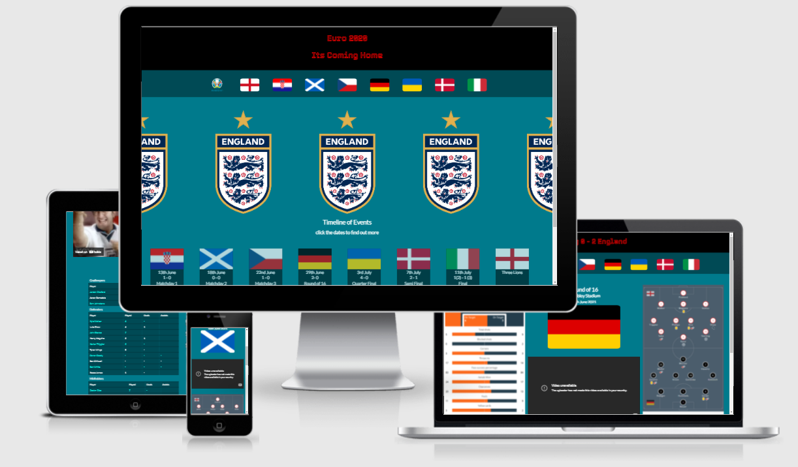

# Its Coming Home

England recently had a brilliant run in the Euros. Runner up, the furthest they've finished in the history of the competition. The goal of Coming Home is to bring to life the essential details of a moment many England fans will hope to cherish for years to come. This will be achieved through the display of fixtures, highlights and stats.

## UX

### External Users Goals

The site user will relive each fixture through the multimedia and description on display. They will find out about stats, locations and player selection information linked to each game.

### A user should be able to …
- As a user I want to find out what teams England faced in the Euros.
- As a user I will find out what dates each of England's games happened on.
- As a user I will be able to naviagate through each country easily.
- As a user I will be able to see what England players were selected for each game.
- As a user I will leave with knowledge about England's campaign.
- As a user I will be able to watch all the England goals.
- As a user I will be able to find out the scores of each game.
- As a user I'll have access to which stadiums each game was played in.

### Site Owners Aims

#### A site owners goal is to ...

- The aim is to spread knowledge about the English football team.
- As a site owner I will display the date of each fixture.
- As a site owner I will document the stats of each game.
- As a site owner I will make the website easy to navigate.
- As a site owner I will show highlight videos.

# Features

## Existing Features
### Flag Navigation Bar
- The flag navigation bar includes every country England faced during euro 2020. Opacity is added when hovering icons for easy navigation.

### Landing Page Hero Image
The hero image is of the England National Teams flag to give the user a sense of what the site is about straight away.

### Landing Page Timeline
Each flag has the date of the match and is structured in order so the end user can see the progression of the England team in an easy to follow format.

### Landing Page Footer
The landing page footer has links to the England National teams youtube and facebook channels to help the end user find out more information.

### England Page Hero Image
- This image depicts each player of the 26 man England team selected for the euros. Through this the end user will start to build familiarity with the England squad.

### Highlight Videos
- The highlight videos allow end user to relive each match and provides a source of entertainment and visual stimulation.

### Stats and Team XI Images
- This creates a simple and fun way to inform the end user about the stats of each game and shows them who started in each match.

## Features Left to Implement
- Man of the Match stats for each game.
- Finish the assists section for the stats.

## Wireframes

### Desktop

#### Landing Page Option 1

#### Landing Page Option 2 

#### Landing Page Option 3

#### England Page

#### Opponent Page

# Tablet

### Landing Page

### England Page

### Opponent Page

# Mobile

### Landing Page

# Design

## Color Scheme
The Blue Red and White are used to replicate the England kit colours.

## Typography
The [Tourney](https://fonts.google.com/specimen/Tourney?query=tourney) font is used to make the site title more playful and fun. Lato is used throughout the rest of the body.

### Potential Features to include:

- A timeline of events
- Images and videos to support each event
- Facts and stats to backup content
- Dates and locations
- Flag Navigation

# Testing

## Responsivity 

- I discovered through the use of the developer tools that the site was not optimized for small screen sizes like mobile browsers. The iphone 5 screen size was particularly uncompromising. It seemingly ignored the layout I tried to present. I had to manually add padding to the right side of the screen to center my elements.

- I tested my sites responsivity by changing the screen size via Google Chrome Developer tools and made adjustments to the css where I saw fit.

- I made sure all links in the navbar lead to the right pages. I did this by running through each page clicking on each flag and navigation link.

# Validator Testing

# HTML

- Upon using the w3.org validator I came across a few minor issues. I had to remove my spans which wrapped around each p tag.

# CSS

- Upon using the validator I came across no issues with the css.

# Deployment

This site was deployed to GitHub pages. To deploy the project to GitHub Pages, follow these steps:
- navigate to the [repository](https://github.com/devisis/its-coming-home)
- from the Settings page, click on "Pages"
- select the **main** branch from the dropdown, and click "Save*
- the site is now deployed at [https://devisis.github.io/its-coming-home](https://devisis.github.io/its-coming-home)

## Local Deployment

To make a local copy, you can type the following command in your IDE terminal:
- `git clone https://github.com/devisis/its-coming-home.git`

Alternatively, if you are using Gitpod, you can use this link:
- [Open in Gitpod](https://gitpod.io/#https://github.com/devisis/its-coming-home)

# Credits

## Media 
- The main page photo was taken from Wikipedia.
- The flag images were sourced from cdn.countryflags.com.
- The imbeded highlight videos were taken from YouTube.
- The England squad photo was taken from theathletic.co.uk.
- The English player stats on the England page were sourced from the Euro2020 website.
- The team sheets and match stats on the opponents pages were sourced from footballcritic.com.